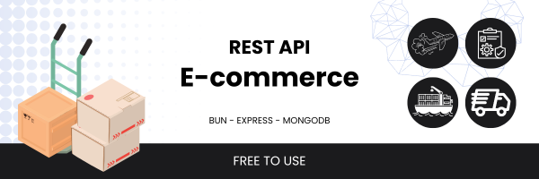

# E-commerce REST API With [Bun](https://bun.sh/), [Express](https://expressjs.com/), [MongoDB](https://www.mongodb.com/)



Features :

* JsonWebToken based Authentication
* Product CRUD
* Product search(category or name) & Pagination
* Add to Cart & Add to WishList
* Limited Product Quantity
* Add Order and Order status
* Comment CRUD
* Report User and Ban
* User search & profile
* Role request [Admin & Seller] & Send Email
* Admin panel & Admin role
* Ban & Permission & JWT-Cookie middleware

### Description 
Mid level E-commerce Rest API, Technologies i use : Typescript, Bun, MongoDB, Express, js libraries i use : bcrypt, cookie-parser, JWT, mongoose, nodemailer, multer, cloud image storage : cloudinary
### Install packages
```shell
npm install -g bun # install bun runtime
bun install # install all dependencies
```
### Setup .env file
``` shell
PORT
DATABASE_URL
JWT_SECRET
NODE_ENV
CLOUDINARY_CLOUD_NAME
CLOUDINARY_API_KEY
CLOUDINARY_API_SECRET
HOST_NAME # mail host name
MAIL_USERNAME
MAIL_PASSWORD
```

### Start the app
```shell
bun run dev # run with --watch mode 
bun start
```

<i>Ashkan<i>
